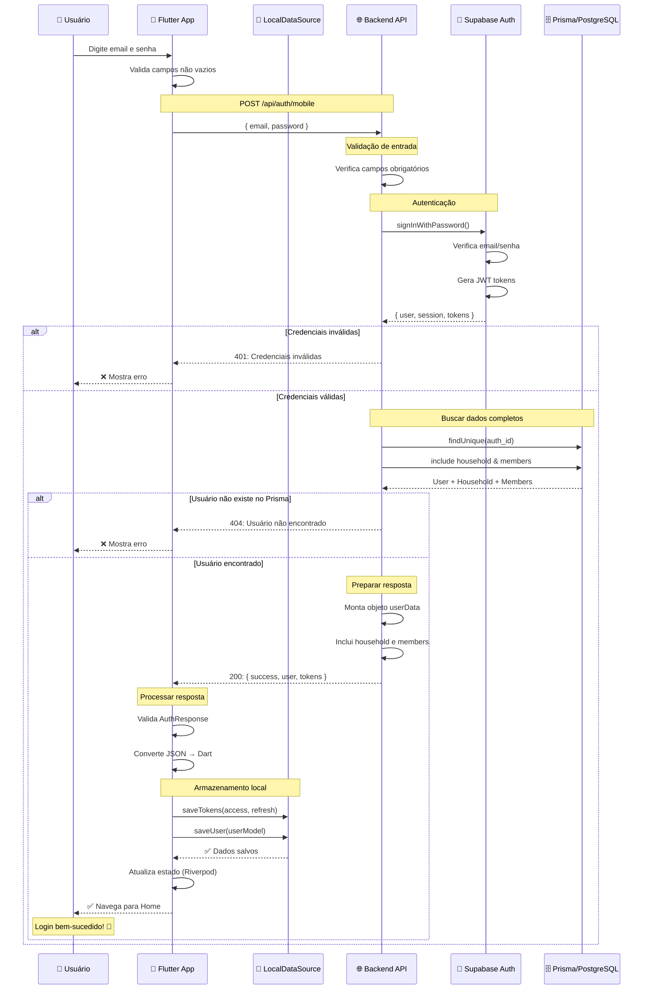
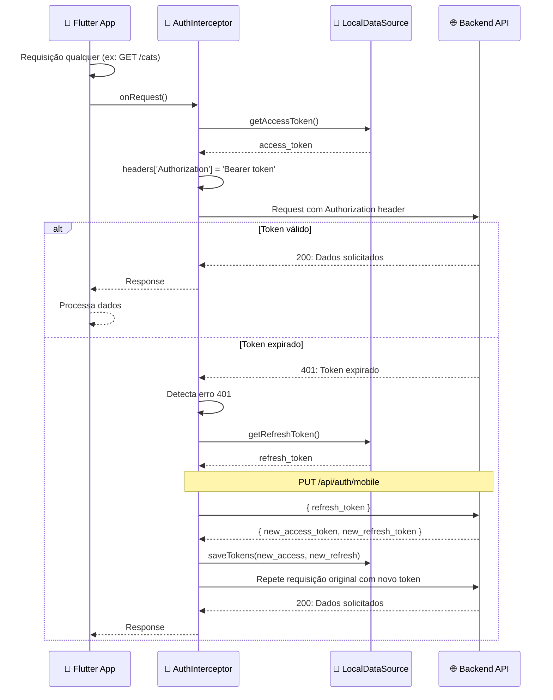
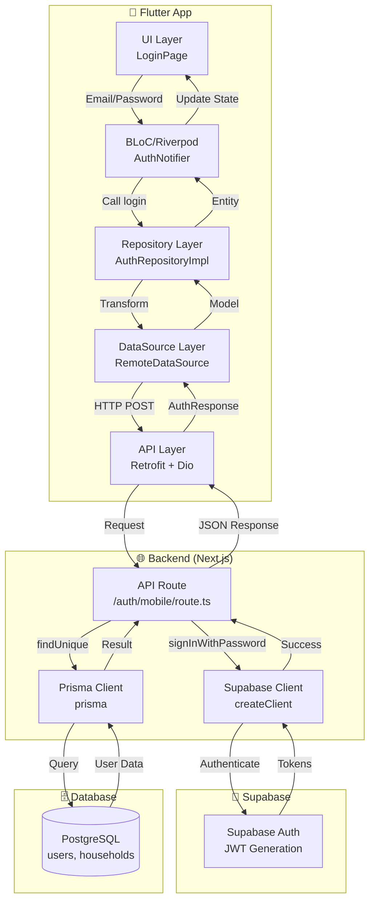
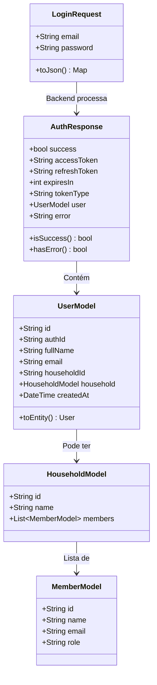
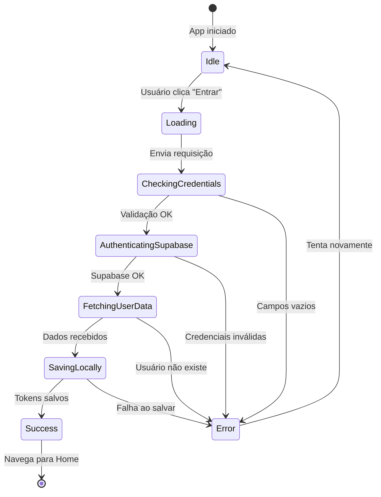
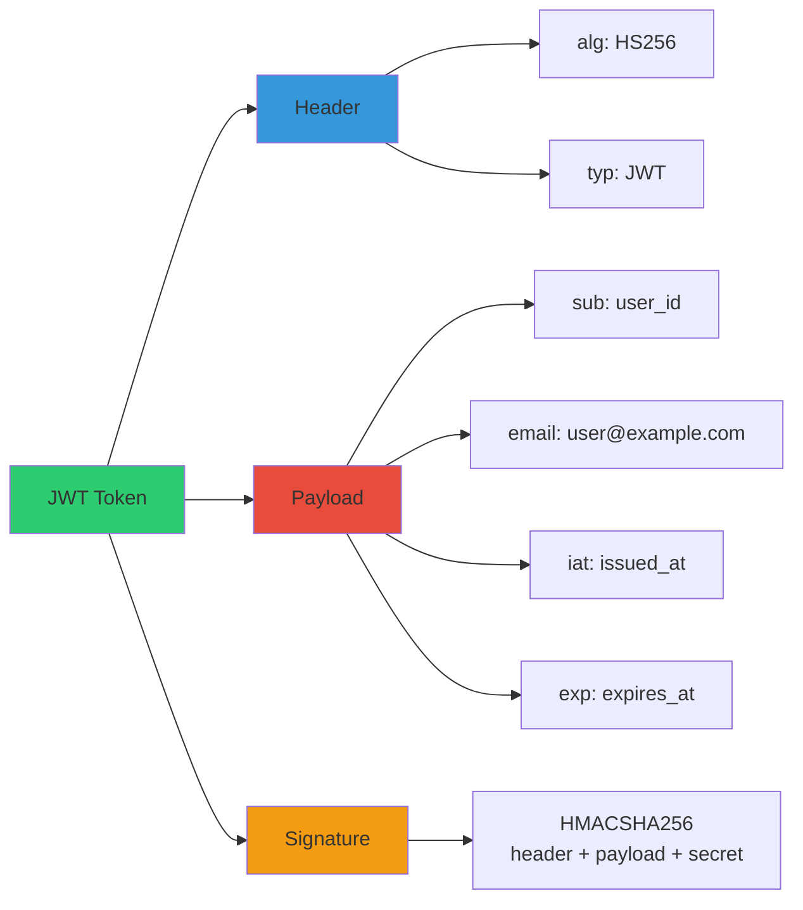
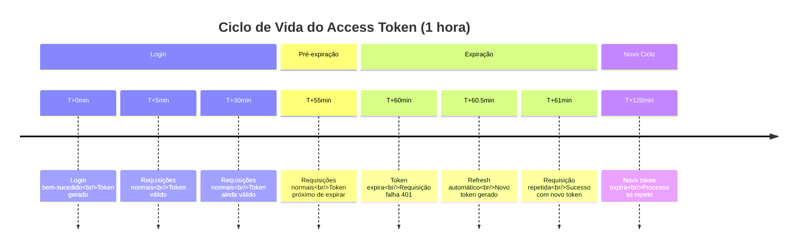
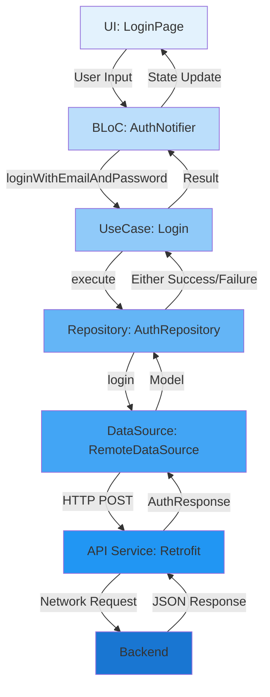
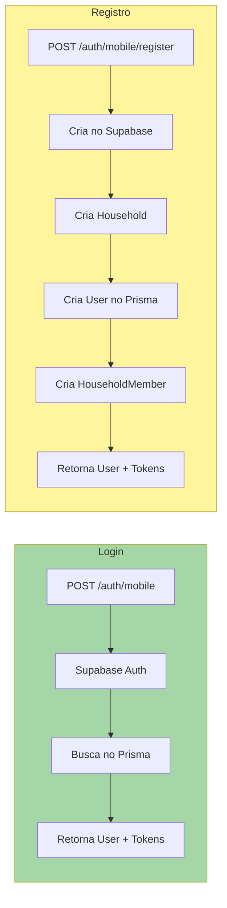

# 🔄 Diagrama de Fluxo - Login no Mealtime

## 📊 Fluxo Completo de Autenticação

## 🔑 Uso do Token em Requisições Subsequentes

## 🏗️ Arquitetura do Sistema

## 📦 Estrutura de Dados

## 🔄 Estados do Login

## 🔐 Estrutura do JWT Token

## ⏱️ Ciclo de Vida do Token

## 🌊 Fluxo de Dados no Flutter

## 📊 Comparação: Login vs Registro

---

## 📝 Legenda

| Símbolo | Significado |
|---------|-------------|
| 👤 | Usuário final |
| 📱 | Aplicativo Flutter |
| 💾 | Armazenamento local |
| 🌐 | Backend/API |
| 🔐 | Supabase Auth |
| 🗄️ | Banco de dados |
| ✅ | Sucesso |
| ❌ | Erro |
| 🎉 | Operação concluída |

---

## 🔗 Links Úteis

- [Visualizar diagramas Mermaid online](https://mermaid.live)
- [Documentação Mermaid](https://mermaid.js.org)
- [Processo de Login completo](./PROCESSO_LOGIN_BACKEND.md)

---

**Última atualização:** Janeiro 2025

