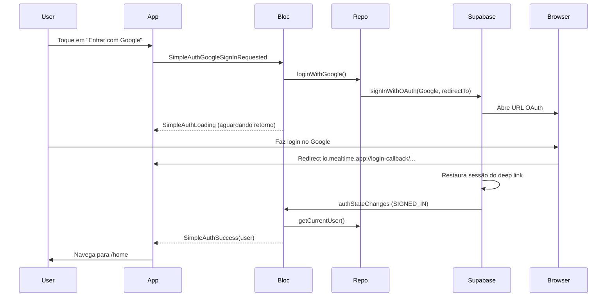

# Plano: Login com conta Google

Objetivo: permitir que o usuário entre no app usando “Entrar com Google”, usando o fluxo OAuth do Supabase (navegador/WebView) e o deep link já configurado (`io.mealtime.app://login-callback/`).

---

## 1. Visão do fluxo

- O app **não** precisa do pacote `google_sign_in`: o Supabase usa OAuth via navegador e redirect.
- A sessão chega quando o usuário volta ao app pelo deep link; o Bloc reage ao `authStateChanges` e emite `SimpleAuthSuccess`.

---

## 2. Configuração externa (Supabase + Google Cloud)

- **Supabase Dashboard**
  - **Authentication → Providers**: ativar **Google** e preencher Client ID e Client Secret (obtidos no Google Cloud).
  - **Authentication → URL Configuration**:
    - **Redirect URLs**: incluir `io.mealtime.app://login-callback/` (e variante sem barra final se o Supabase usar).
- **Google Cloud Console**
  - Criar projeto (ou usar existente) e ativar “Google+ API” / “Google Identity” conforme doc do Supabase.
  - Criar credenciais OAuth 2.0 (tipo “Aplicativo da Web” ou conforme Supabase).
  - **URIs de redirecionamento autorizados**: adicionar a URL de callback que o Supabase mostrar em **Authentication → Providers → Google** (ex.: `https://<project-ref>.supabase.co/auth/v1/callback`).
- **Perfil do usuário (primeira vez com Google)**  
  Se hoje o perfil é criado só no `signUp` por email, é necessário garantir criação para usuários OAuth (ex.: trigger no DB ao inserir em `auth.users`, ou criação no app na primeira vez que `getCurrentUser` retornar usuário sem linha em `profiles`). Isso fica fora do escopo do código Flutter, mas deve ser garantido para não quebrar a home.

---

## 3. Alterações no código (Flutter)

### 3.1 Camada de infraestrutura / core

| Arquivo | Alteração |
|--------|-----------|
| `lib/core/auth/simple_auth_manager.dart` | Adicionar método `signInWithGoogle()` que chama `_supabase.auth.signInWithOAuth(OAuthProvider.google, redirectTo: SupabaseConfig.deepLinkUrl)`. Tratar exceções e retornar `Future<void>` (ou um tipo simples de resultado se quiser diferenciar “navegador abriu” de “erro”). |
| `lib/core/supabase/supabase_config.dart` | Já expõe `deepLinkUrl`; apenas garantir que está igual à URL configurada no Supabase (ex.: `io.mealtime.app://login-callback/`). |

### 3.2 Repositório e use case

| Arquivo | Alteração |
|--------|-----------|
| `lib/features/auth/data/repositories/simple_auth_repository.dart` | Novo método `Future<Either<Failure, void>> loginWithGoogle()` que chama `SimpleAuthManager.signInWithGoogle()` e mapeia exceções para `Left(ServerFailure(...))` ou `Left(AuthFailure(...))`. |
| `lib/features/auth/domain/usecases/simple_login_usecase.dart` (ou novo arquivo) | Novo use case `SimpleLoginWithGoogleUseCase` que chama `repository.loginWithGoogle()` e retorna `Either<Failure, void>`. |

### 3.3 BLoC

| Arquivo | Alteração |
|--------|-----------|
| `lib/features/auth/presentation/bloc/simple_auth_event.dart` | Novo evento: `class SimpleAuthGoogleSignInRequested extends SimpleAuthEvent`. |
| `lib/features/auth/presentation/bloc/simple_auth_bloc.dart` | (1) Injetar dependência que forneça `Stream<AuthState>` (ex.: `SimpleAuthManager.authStateChanges` ou um wrapper). (2) Registrar handler para `SimpleAuthGoogleSignInRequested`: emitir `SimpleAuthLoading`, chamar o use case de login com Google; em sucesso, emitir um estado intermediário opcional (ex. “aguardando retorno”) ou manter `SimpleAuthLoading`; em falha, emitir `SimpleAuthFailure`. (3) No construtor do Bloc, assinar `authStateChanges`; quando o evento for `SIGNED_IN` (ou `initialSession` com sessão), chamar `getCurrentUserUseCase` e, se houver usuário, emitir `SimpleAuthSuccess(user)`. Evitar emitir sucesso duplicado se o estado já for `SimpleAuthSuccess` com o mesmo usuário. |

### 3.4 DI

| Arquivo | Alteração |
|--------|-----------|
| `lib/core/di/injection_container.dart` | Registrar `SimpleLoginWithGoogleUseCase`. No `SimpleAuthBloc`, injetar o novo use case e o stream `authStateChanges` (ou o `SimpleAuthManager` para acessar o stream). |

### 3.5 UI e localização

| Arquivo | Alteração |
|--------|-----------|
| `lib/features/auth/presentation/pages/expressive_login_page.dart` | Adicionar botão “Entrar com Google” (segundo o design: ex. `OutlinedButton` ou `FilledButton.tonal` com ícone do Google), que dispara `SimpleAuthGoogleSignInRequested`. Enquanto o estado for `SimpleAuthLoading` (e opcionalmente “aguardando Google”), desabilitar o botão ou mostrar indicador. No `BlocListener`, em `SimpleAuthFailure` exibir mensagem (ex.: SnackBar ou `SelectableText.rich` conforme regras do projeto). |
| `lib/l10n/app_pt.arb` (e demais `.arb`) | Nova chave, ex.: `auth_signInWithGoogle`: "Entrar com Google". |
| Rodar geração de l10n (ex.: `flutter gen-l10n`) e usar `context.l10n.auth_signInWithGoogle` no botão. |

---

## 4. Resumo de arquivos a tocar

- **Core**: `simple_auth_manager.dart`, `supabase_config.dart` (só conferir URL).
- **Data**: `simple_auth_repository.dart`.
- **Domain**: use case de login com Google (novo ou em `simple_login_usecase.dart`).
- **Presentation**: `simple_auth_event.dart`, `simple_auth_bloc.dart`, `expressive_login_page.dart`.
- **DI**: `injection_container.dart`.
- **L10n**: todos os `.arb` + `flutter gen-l10n`.

Nenhuma dependência nova no `pubspec.yaml` é obrigatória: `supabase_flutter` já expõe `signInWithOAuth` e `OAuthProvider.google`.

---

## 5. Testes manuais sugeridos

1. Com Google provider desativado no Supabase: tentar “Entrar com Google” e validar mensagem de erro.
2. Com Google ativo e redirect URL correta: tocar no botão → abre navegador → login no Google → redirect para o app → sessão criada e navegação para `/home`.
3. Usuário novo (primeiro login com Google): conferir se o perfil é criado (trigger ou lógica no app) e se a home carrega sem erro.
4. Modo escuro e claro: garantir que o botão e mensagens de erro respeitam o tema.

---

## 6. Observações

- **Deep link**: o app já declara `io.mealtime.app` no `AndroidManifest.xml` e no `Info.plist`; o Supabase precisa receber o mesmo redirect no Dashboard.
- **PKCE**: o projeto já usa `AuthFlowType.pkce` em `SupabaseConfig.initialize()`, adequado para cliente móvel.
- **Estado “aguardando retorno”**: opcional; manter apenas `SimpleAuthLoading` até o `authStateChanges` disparar simplifica a UX e o código.
